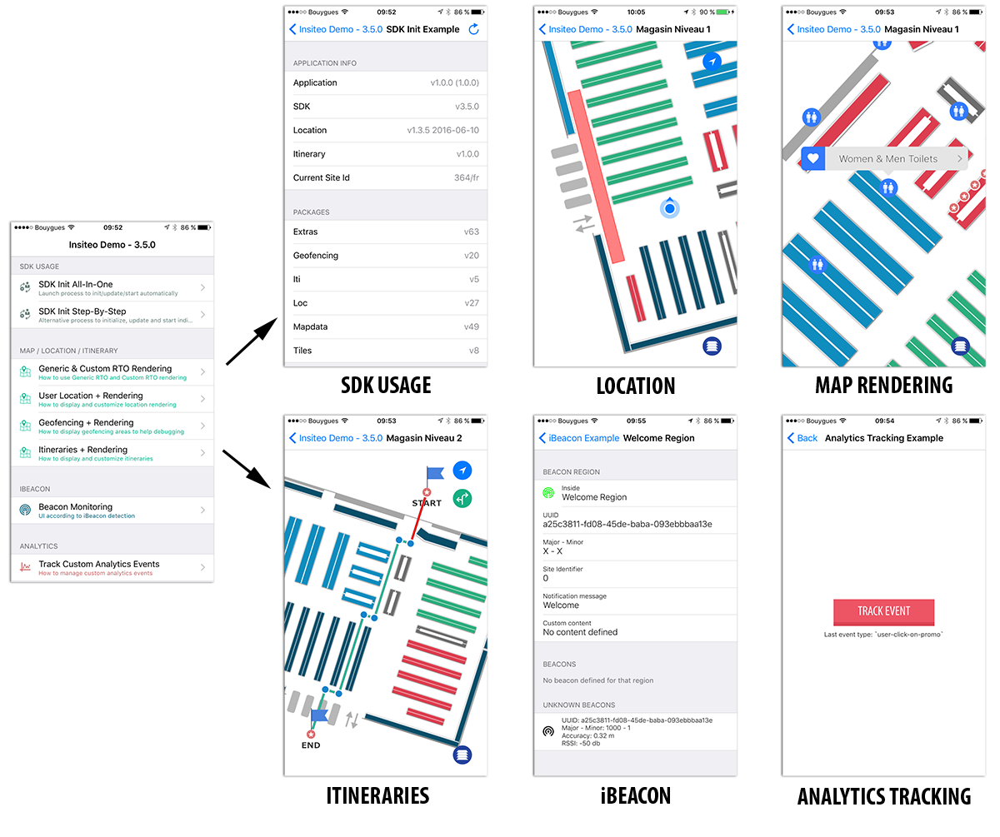

# Insiteo SDK v3 Examples

We provide a sample application to illustrate SDK integration and use cases.

### 1. SDK Usage Example

- This example will show you how to initialize, update and start the SDK and access to your configuration.

### 2. iBeacon Example

- This example will show you how to manage iBeacon from your configuration and will illustrate how to detect region entry/exit to manage the UI.

### 3. Map / Location / Itineraries Rendering Example

- This example will show you how to create and present a map view, draw custom objects,
- how to retrieve user location and how to render and customize the location object on your map view,
- how to use geofencing with user location (+ rendering),
- how to compute itineraries between points and from/to user location (+ rendering and customization).

### 4. Analytics Tracking Example

- This example will simply show you how to track custom analytics event.
