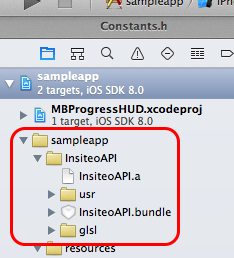

# Insiteo iOS SDK

Insiteo is a provider of indoor location based services such as Map rendering, Location, Itinerary and Geofencing. For further integration documentation you can have a look at the developer's site: [http://dev.insiteo.com/api](http://dev.insiteo.com/api).

This sample application will demonstrate how to take full advantage of those services and integrate them in your application.

If you wish to evaluate indoor location in your own building, you can order our test pack including 8 BLE beacons here:
[http://www.insiteo.com/joomla/index.php/en/contact-us](http://www.insiteo.com/joomla/index.php/en/contact-us).

If you want more information on our services [http://www.insiteo.com/joomla/index.php](http://www.insiteo.com/joomla/index.php)


## Insiteo SDK Class Reference

Insiteo SDK class latest reference is available [here](http://dev.insiteo.com/api/doc/ios/3.5/index.html).


## Installation

> **Requirements:** The Insiteo `library` requires `iOS 5.1.1` or later.

### CocoaPods

To integrate InsiteoSDK into your project using CocoaPods, add the following line into your Podfile:

```ruby
pod 'InsiteoSDK', :podspec => 'https://raw.github.com/Insiteo/ios-v3/master/InsiteoSDK.podspec'
```

Then run:

```bash
$ pod install
```

You can now import our SDK using `#import <InsiteoSDK/InsiteoSDK.h>`.

### Manual

Alternatively, you can install the iOS SDK manually by following the steps below:

- Download the [Insiteo SDK](https://github.com/Insiteo/ios-v3/releases/download/3.5.0/InsiteoSDK-v3.5.0.zip).

Insiteo's modules are provided as an iOS `library` and an iOS `bundle`. To use them, you will need to link it with your application project. To do that, simply add the `InsiteoSDK` folder to you project.



> **Important:** If you plan to use our 3D features, **don't forget to add** the `glsl` folder in your application resources.

Then you will need to add all the wanted frameworks in the `Link Binary With Libraries` panel. Please also check the framework dependencies below and add any additional required framework. The InsiteoSDK `library` requires the following frameworks and libraries:

- `CoreBluetooth.framework` for location purposes
- `CoreGraphics.framework` for rendering purposes
- `CoreLocation.framework` for location purposes
- `CoreMotion.framework` for location purposes
- `CoreTelephony.framework` for analytics purposes
- `CoreText.framework` for rendering purposes
- `Foundation.framework`
- `OpenAL.framework` for rendering purposes
- `OpenGLES.framework` for rendering purposes
- `QuartzCore.framework` for rendering purposes
- `Security.framework`
- `UIKit.framework`
- `libstdc++.6.0.9.dylib`
- `libz.dylib`
- `libsqlite3.dylib`

Don't forget to add the `-ObjC` flag in your build settings `Other linker flags` section.

> **Looking for an older version?** You can get an older version of the SDK in the [releases](https://github.com/Insiteo/iOS/releases) section.

### Location Authorization iOS 8+

**Since iOS 8**, Apple requires you to ask user permission to use their location. You need to specify in your application *Info.plist* which location authorization is needed. Without any key, the SDK (and your application) will not have any access to location services.

- **Support both (Recommended)** : if you add the two keys to your *Info.plist*, the user will have the possibility to later change location authorizations through the application settings menu in iOS.

- Ask for **Always** authorization is required if you want to make use of background location services (such as iBeacon wake up). You must add the `NSLocationAlwaysUsageDescription` key.

- Ask for **When in use** authorization if you are not interested in background location services (your application will not be awaken by iBeacon, thus strongly reducing the benefits of using our SDK), add the `NSLocationWhenInUseUsageDescription`key.

> **Advice:** When you define your description keys, the more the end-user will understand which value-add services are provided by your app, the more your user will be prone to accept the authorization.


## Getting Started

### SDK Initialization and Start

> **Note:** We highly recommend you to store all your account information, such as your `API key`, your `server type` and so on, in your application `.plist` file. We will provide you such information.

```xml
<plist>
  ...
  <key>ISApiKey</key>
  <string>YOUR-API-KEY</string>
  <key>ISAnalyticsAutoStart</key>
  <true/>
  <!-- In order to get ready to use our map module, you will need to specify the render mode you plan to use. You can choose between ISERenderMode2D and ISERenderMode3D. Please note that the default mode is ISERenderMode2D. -->
  <key>ISERenderMode</key>
  <string>ISERenderMode3D</string>
  <!-- The initialization process requires a ISEServerType that can take the following values: ISEServerTypeDev, ISEServerTypeTest or ISEServerTypeProd. Depending on its values the downloaded data will be stored under the appropriate folder (respectively 'dev', 'test' and 'release'). -->
  <key>ISEServerType</key>
  <string>ISEServerTypeTest</string>
  ...
</plist>
```

The first step to access Insiteo's services, is to initialize our SDK via the [`Insiteo`](http://dev.insiteo.com/api/doc/ios/3.5/Classes/Insiteo.html) singleton. This will be done with the [`launchWithInitializeHandler`](http://dev.insiteo.com/api/doc/ios/3.5/Classes/Insiteo.html#//api/name/launchWithInitializeHandler:andChooseSiteHandler:andStartHandler:andUpdateHandler:andUpdateProgressHandler:) which will inform you when each step end through block handlers you specified.

Here is a snippet that will show you how to properly do the initialization process using the "all-in-one" method:

```objective-c
// Initialize the SDK
[[Insiteo sharedInstance] launchWithInitializeHandler:^(ISError *error,
                                                        ISUserSite *suggestedSite,
                                                        Boolean fromLocalCache) {
    // Check initialization status
    Boolean initializationSuccess = (error == nil);
}
                                 andChooseSiteHandler:^CLLocation *{
                                     // You can return here a CLLocation that will determine the most suitable site to start
                                     return [[CLLocation alloc] initWithLatitude:latitude longitude:longitude];
                                 }
                                      andStartHandler:^(ISError *error, NSArray *newPackages) {
                                          // Check start status
                                          if (error == nil) {
                                              // Success!
                                              Boolean updateAvailable = ([newPackages count] > 0);
                                          } else {
                                              // [1] Error: it means that Insiteo servers could not be reached.
                                              // If you want to use an specific module, you have to check if your
                                              // application has enough data to run. This can be done using
                                              // `hasPackage:` from `ISSite` class.
                                          }
                                      }
                                     andUpdateHandler:^(ISError *error) {
                                         // Check update status
                                         if (error == nil) {
                                             // Success! You can now launch your application with all up to date data.
                                         } else {
                                             // An error occured, same as [1]
                                         }
                                     }
                             andUpdateProgressHandler:^(ISEPackageType packageType,
                                                        Boolean download,
                                                        int progress,
                                                        int total) {
                                 // Here you get the current package which is downloading or installing and you can
                                 // compute progress to update your loading view, for example.
                                 float totalProgress = (float)progress / (float)total;
                             }];

// Note: The initialization process can be cancelled using the `currentTask` property of the `Insiteo` singleton (see `ISCancelable` protocol documentation).
```

#### SDK Initialization Step-by-step and Update Current Site

The SDK provides a couple of initialization methods to let you initialize, update and start manually (see [Insiteo class reference](http://dev.insiteo.com/api/doc/ios/3.5/Classes/Insiteo.html#//api/name/initializeWithAPIKey:andLanguage:andAnalyticsAutoStart:andServerType:andServerUrl:andRenderMode:andInitializeHandler:andChooseSiteHandler:) and sample app for more details).

When started, you can override selected site by calling the [`startAndUpdateWithSite`](http://dev.insiteo.com/api/doc/ios/3.5/Classes/Insiteo.html#//api/name/startAndUpdateWithSite:andStartHandler:andUpdateHandler:andUpdateProgressHandler:) method on the [`Insiteo`](http://dev.insiteo.com/api/doc/ios/3.5/Classes/Insiteo.html) singleton.

#### SDK Debug Mode

If something wrong or is not working as expected maybe you can try to enable SDK debug mode by calling [`[Insiteo setDebugMode:YES]`](http://dev.insiteo.com/api/doc/ios/3.5/Classes/Insiteo.html#//api/name/setDebugMode:).


## Where To Go From Here?

- Map rendering:
	- [Display your first map](readme/map.md).
	- [Add graphical objects on map](readme/map.md#2-add-graphical-objects-on-map)
- Location:
	- [Get your first location](readme/location.md).
	- [Setup your first geofencing zone](readme/geofence.md).
	- [Configure your iBeacons](readme/beacon.md).
	- [Room counting with iBeacons](readme/room_counting.md).
- Itinerary:
	- [Compute your first itinerary](readme/itinerary.md).
- Analytics tracking events:
	- [Track Custom Events](readme/analytics.md).
