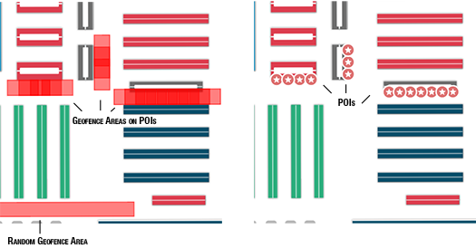

# Geofencing

## Requirements

- Successful SDK initialization and Site started (see [Getting Started Guide](../README.md)).
- **Packages dependencies**: you need to have downloaded and installed the following packages:
	- `ISEPackageTypeLocation` because geofencing is based on user location (see [Location Guide](location.md)).
	- `ISEPackageTypeGeofencing` which contains areas definitions and other required data.

> **Reminder:** To check if a package is available for the current site, just call `[[Insiteo currentSite] hasPackage:My-PACKAGE-TYPE]`.

## 1. Start Geofencing module

By default, the geofencing module is created inside the [`ISLocationProvider`](http://dev.insiteo.com/api/doc/ios/3.5/Classes/ISLocationProvider.html) but is not running. To start the module, you will need to get the [`ISGeofenceProvider`](http://dev.insiteo.com/api/doc/ios/3.5/Classes/ISGeofenceProvider.html) instance and set a [`ISGeofenceDelegate`](http://dev.insiteo.com/api/doc/ios/3.5/Protocols/ISGeofenceDelegate.html) to be notified when user enters/stay/leaves a specific geofence area:

```objective-c
// Get the geofencing module from location provider
ISGeofenceProvider *geofenceProvider = (ISGeofenceProvider *)[[ISLocationProvider sharedInstance] getLbsModule:ISELbsModuleTypeGeofencing];
    
// "Start" by adding a delegate
[geofenceProvider setDelegate:aDelegate];
```

### Geofence areas detection

After starting the module, your class implementing the `ISGeofenceDelegate` protocol will be notified with 3 arrays of [`ISGeofenceArea`](http://dev.insiteo.com/api/doc/ios/3.5/Classes/ISGeofenceArea.html) objects which are represented by a center and a polygon.

- the first one contains all zones the user has just entered,
- the second one contains all zones where the user is still inside and has spent a specific time,
- the third one contains all zones the user has just left.

```objective-c
// Called when geofencing module has new data available
- (void)onGeofenceDataUpdateWithEnteredAreas:(NSArray *)enteredAreas
                              andStayedAreas:(NSArray *)stayedAreas
                                andLeftAreas:(NSArray *)leftAreas {
    // Entered areas
    for (ISGeofenceArea *area in enteredAreas) {
        NSLog(@"User entered area %@", area.guid);
    }
    
    // Stayed areas
    for (ISGeofenceArea *area in stayedAreas) {
        NSLog(@"User still is in area %@", area.guid);
    }
    
    // Left areas
    for (ISGeofenceArea *area in leftAreas) {
        NSLog(@"User has left area %@", area.guid);
    }
}
```

### Add and remove geofence areas programmatically

Geofence areas can be added to the `ISGeofenceProvider` directly from your application in addition to the  fetched ones from the server. For example, it enables your content to be more accurate to a specific user's behaviour or a specific context. 

Created geofence areas will depend on zones configuration (back-end) by default or specified parameters during creation (polygon width, time to consider a stay, an entry or exit, label, message, etc.). 

#### Add a geofence area near a zone or a POI

A geofence area can be associated to a [`ISZone`](http://dev.insiteo.com/api/doc/ios/3.5/Classes/ISZone.html) (the polygon will be created at the front of the zone according to its size) or [`ISZonePoi`](http://dev.insiteo.com/api/doc/ios/3.5/Classes/ISZonePoi.html) (the polygon will be centered and created with a size).
 
```objective-c
// Associated to a zone (ISZone)
// Using default configuration for the polygon
- (ISGeofenceArea *)addGeofenceAreaWithZoneId:(int)zoneId andLabel:(NSString *)label andMessage:(NSString *)message;

// Custom polygon
- (ISGeofenceArea *)addGeofenceAreaWithZoneId:(int)zoneId
                                   andPolygon:(NSMutableArray *)polygon
                                     andLabel:(NSString *)label
                                   andMessage:(NSString *)message;

// Associated to a POI (ISZonePoi)
- (ISGeofenceArea *)addGeofenceAreaWithZonePoi:(ISZonePoi *)zonePoi
                                      andLabel:(NSString *)label
                                    andMessage:(NSString *)message;

- (ISGeofenceArea *)addGeofenceAreaWithZonePoi:(ISZonePoi *)zonePoi
                                    andPolygon:(NSMutableArray *)polygon
                                      andLabel:(NSString *)label
                                    andMessage:(NSString *)message;
```

#### Add a geofence area at a specific position

It is possible to add a geofence area at a specific [`ISPosition`](http://dev.insiteo.com/api/doc/ios/3.5/Classes/ISPosition.html), you can use the methods shown below. A square of size on the given parameter (or by default 4 time the size defined in the configuration file) and center on the given position will be created.

```objective-c
// Use default time configuration
- (ISGeofenceArea *)addGeofenceAreaWithGUID:(NSString *)guid
                                  andCenter:(ISPosition *)center
                                   andLabel:(NSString *)label
                                 andMessage:(NSString *)message;

// Specify time for entry/exit and stay events
- (ISGeofenceArea *)addGeofenceAreaWithGUID:(NSString *)guid
                                  andCenter:(ISPosition *)center
                                   andLabel:(NSString *)label
                                 andMessage:(NSString *)message
                               andEventTime:(float)eventTime;
```

#### Remove a geofence area

To remove a `ISGeofenceArea` from the geofence provider, just call the appropriate remove method based on how it was added.

```objective-c
// If the area was added with a unique identifier
- (void)removeGeofenceAreaWithGuid:(NSString *)guid;

// If the area was associated to a specific zone identifier
- (void)removeGeofenceAreaWithZoneId:(int)zoneId;

// If the area was associated to a POI
- (void)removeGeofenceAreaWithZonePoi:(ISZonePoi *)zonePoi;

// Or using directly the area to remove
- (void)removeGeofenceAreaWithArea:(ISGeofenceArea *)area;
```

## 2. Geofencing rendering

Such as [location rendering](location.md#2-user-location-rendering) or [itinerary rendering](itinerary.md#2-itineraries-rendering), geofence areas can be rendered on your map view (essentially for debug). You have to retrieve the specific `ISRenderer` from the geofence provider and add it manually on the map view to see your areas. By default, the [`ISGeofenceAreaRenderer`](http://dev.insiteo.com/api/doc/ios/3.5/Classes/ISGeofenceRenderer.html) will draw geofence areas polygon in red and it cannot be customized for the moment.

```objective-c
// Get the geofencing module from location provider
ISGeofenceProvider *geofenceProvider = (ISGeofenceProvider *)[[ISLocationProvider sharedInstance] getLbsModule:ISELbsModuleTypeGeofencing];
// Get geofence areas renderer
ISGeofenceAreaRenderer *geofenceAreaRenderer = geofenceProvider.renderer;
// Add it to the map view
[self.mapView addRenderer:geofenceAreaRenderer];
```

Here is how geofence areas can looks like on your map view:



> **Note:** 3D rendering is not available for this module.


## Where To Go From Here?

- Map rendering:
	- [Display your first map](map.md).
	- [Add graphical objects on map](map.md#2-add-graphical-objects-on-map)
- Location:
	- [Get your first location](location.md).
	- [Configure your iBeacons](beacon.md).
	- [Room counting with iBeacons](room_counting.md).
- Itinerary:
	- [Compute your first itinerary](itinerary.md).
- Analytics tracking events:
	- [Track Custom Events](analytics.md).