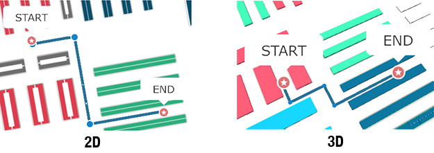

# Itinerary

## Requirements

- Successful SDK initialization and Site started (see [Getting Started Guide](../README.md)).
- **Packages dependencies**: you need to have downloaded and installed the following packages:
	- `ISEPackageTypeItinerary` package, which contains all itinerary required data.
	- Optional: if you attempt to use itinerary with user location, you will need to have installed the `ISEPackageTypeLocation` package and have started properly user location detection (see [Location Guide](location.md)).

> **Reminder:** To check if a package is available for the current site, just call `[[Insiteo currentSite] hasPackage:My-PACKAGE-TYPE]`.


## 1. Compute Itineraries

In order to compute itineraries, you will have to work with the [`ISItineraryProvider`](http://dev.insiteo.com/api/doc/ios/3.5/Classes/ISItineraryProvider.html) main class.

To access itinerary provider singleton, you have to get the instance from Insiteo location provider [`ISLocationProvider`](http://dev.insiteo.com/api/doc/ios/3.5/Classes/ISLocationProvider.html) singleton and use the [`getLbsModule:`](http://dev.insiteo.com/api/doc/ios/3.5/Classes/ISLocationProvider.html#//api/name/getLbsModule:) method:

```objective-c
// Get itinerary provider from Insiteo location singleton
ISItineraryProvider *itineraryProvider = (ISItineraryProvider *)[[ISLocationProvider sharedInstance] getLbsModule:ISELbsModuleTypeItinerary];
```

The itinerary provider class has a couple of methods to compute itineraries between two or multiple points, from user location etc. An itinerary request is represented by the [`ISItineraryBaseRequest`](http://dev.insiteo.com/api/doc/ios/3.5/Classes/ISItineraryBaseRequest.html) class which contains itinerary request information and let you the possibility to cancel or recompute.

To handle itineraries computation success (or failure) and recomputation, you can set a [`ISItineraryRequestDelegate`](http://dev.insiteo.com/api/doc/ios/3.5/Protocols/ISItineraryRequestDelegate.html) to the provider and implements required callbacks.


#### Request an itinerary between two points

To compute an itinerary between two Insiteo positions (see [`ISPosition`](http://dev.insiteo.com/api/doc/ios/3.5/Classes/ISPosition.html), x, y and map identifier), simply do like this:

```objective-c
// p1 is on map with id 1
ISPosition *p1 = [ISPosition ISPositionWithX:200 andY:100 andMapId:1];
// p2 is on map with id 2
ISPosition *p2 = [ISPosition ISPositionWithX:50 andY:20 andMapId:2];
// Compute an itinerary between two points (with or without PMR paths)
ISItineraryRequest *request = [itineraryProvider requestItineraryWithStartPoint:p1.coordinates
                                                                  andStartMapId:p1.mapId
                                                                    andEndPoint:p2.coordinates
                                                                    andEndMapId:p2.mapId
                                                                    andDelegate:self
                                                                         andPMR:NO]; // Disabled people
```

The result is a [`ISItineraryRequest`](http://dev.insiteo.com/api/doc/ios/3.5/Classes/ISItineraryRequest.html) object.


#### Request an optimized route between several points

If you want to compute an optimized route between several points, you need to:

- select a computation mode (see [`ISEOptimizationMode `](http://dev.insiteo.com/api/doc/ios/3.5/Constants/ISEOptimizationMode.html)), 
- an array of Insiteo positions (see [`ISPosition`](http://dev.insiteo.com/api/doc/ios/3.5/Classes/ISPosition.html), x, y and map identifier),
- define if you want to keep the first inserted position at the same place during computation (basically the departure),
- define if you want to keep the last inserted position at the same place during computation (basically the arrival).

```objective-c
// Random points
ISPosition *p1 = [ISPosition ISPositionWithX:50 andY:20 andMapId:1]; // Departure
ISPosition *p2 = [ISPosition ISPositionWithX:10 andY:33 andMapId:1];
ISPosition *p3 = [ISPosition ISPositionWithX:6 andY:110 andMapId:2];
ISPosition *p4 = [ISPosition ISPositionWithX:41 andY:23 andMapId:3];
ISPosition *p5 = [ISPosition ISPositionWithX:18 andY:12 andMapId:1]; // No I don't want to use as arrival

// Compute
ISItineraryOptimizedRequest *request = [itineraryProvider requestOptimizedItineraryWithWaypoints:@[ p1, p2, p3, p4, p5 ]
                                                                                    andOptimMode:ISEOptimizationModeNearestNeighbourShortestPath
                                                                            andKeepFirstPosition:YES
                                                                             andKeepLastPosition:NO
                                                                                     andDelegate:self
                                                                                          andPMR:NO];

```

The result is a [`ISItineraryOptimizedRequest`](http://dev.insiteo.com/api/doc/ios/3.5/Classes/ISItineraryOptimizedRequest.html) object.

> **Note:** There are multiple optimization modes available but we **highly recommend** to keep `ISEOptimizationModeNearestNeighbourShortestPath` as the default one.


#### Request an itinerary from user location

To compute an itinerary from the user location, you need to have location available for your current site, and have started the location provider (see [Location Guide](location.md)).

```objective-c
// Arrival point on map id 2
CGPoint arrival = CGPointMake(200, 100);
// Request an itinerary from user location
ISItineraryRequest *request = [itineraryProvider requestItineraryFromCurrentLocationWithEndPoint:arrival
                                                                                     andEndMapId:2
                                                                                     andDelegate:itineraryDelegate
                                                                                          andPMR:NO];
```

The result is a [`ISItineraryRequest`](http://dev.insiteo.com/api/doc/ios/3.5/Classes/ISItineraryRequest.html) object.


#### Itinerary recomputation according to user location

When you ask for an itinerary request depending on user location, you are able to refresh according to a specific distance between the last computed route and current user location using `ISItineraryRequestDelegate` [`onItineraryChangedWithRequest:andDistanceToItinerary:`](http://dev.insiteo.com/api/doc/ios/3.5/Protocols/ISItineraryRequestDelegate.html#//api/name/onItineraryChangedWithRequest:andDistanceToItinerary:) callback:

```objective-c
// We usually recommand to use 10 meters for recomputation
#define kRecomputationDistance 10

- (void)onItineraryChangedWithRequest:(ISItineraryBaseRequest *)request andDistanceToItinerary:(float)distanceToItinerary {
	// You can filter itinerary request according to its class
	if ([request isKindOfClass:[ISItineraryOptimizedRequest class]]) {
		// Ex: I used my location as departure, but I only want to have a route once and I 
		// don't want to recompute each time.
		return;
	}
	
    // Compare the distance between user location to itinerary and your constant value
    if (distanceToItinerary >= kRecomputationDistance) { 
		// It is a simple itinerary with my location, I want to recompute
        [request recompute];
    }
}
```
> **Note:** As a best practise, we do **not recommand** to call `recompute` too often. According to the number of waypoints, the complexity of your map and paths itinerary computation can take several seconds to get a result.


## 2. Itineraries Rendering

> **Note:** See our [Map View rendering guide](map.md) for more details about map and objects rendering.

Like custom graphical objects, itineraries are rendered through a special `ISRenderer` class that should be added on your map view in order to draw paths and waypoints. The [`ISItineraryRenderer`](http://dev.insiteo.com/api/doc/ios/3.5/Classes/ISItineraryRenderer.html) class manages itinerary rendering and allows you to customize colors and shapes of the waypoints and paths. By default, the renderer is created and is a [property](http://dev.insiteo.com/api/doc/ios/3.5/Classes/ISItineraryProvider.html#//api/name/renderer) of the itinerary provider but is not added to the map view. You must add it manually to enable itineraries rendering:

```objective-c
// Get the itinerary provider
ISItineraryProvider *itineraryProvider = (ISItineraryProvider *)[[ISLocationProvider sharedInstance] getLbsModule:ISELbsModuleTypeItinerary];
// Get itinerary renderer
ISItineraryRenderer *itineraryRenderer = itineraryProvider.renderer;
// Add it to the map view
[self.mapView addRenderer:itineraryRender];
```

You can handle itinerary graphical objects touch events on waypoints, instruction path or map switcher clicked by adding a [`ISItineraryRenderDelegate`](http://dev.insiteo.com/api/doc/ios/3.5/Protocols/ISItineraryRenderDelegate.html) to the renderer.

#### Customize itineraries

By default, itineraries looks like:



You have the possibility to customize paths thickness and colors, choose to display or not waypoints, etc. by updating `ISItineraryRenderer` properties:

- Common (both 2D/3D):
	- Path color: use [`frontFillColor`](http://dev.insiteo.com/api/doc/ios/3.5/Classes/ISItineraryRenderer.html#//api/name/frontFillColor),
	- Path thickness: use [`frontStrokeThickness`](http://dev.insiteo.com/api/doc/ios/3.5/Classes/ISItineraryRenderer.html#//api/name/frontStrokeThickness),
- 2D only:
	- Background path color: use [`backFillColor`](http://dev.insiteo.com/api/doc/ios/3.5/Classes/ISItineraryRenderer.html#//api/name/backFillColor),
	- Background path thickness: use [`backStrokeThickness`](http://dev.insiteo.com/api/doc/ios/3.5/Classes/ISItineraryRenderer.html#//api/name/backStrokeThickness),
	- Hide waypoints pictures: set [`onlyPath`](http://dev.insiteo.com/api/doc/ios/3.5/Classes/ISItineraryRenderer.html#//api/name/onlyPath) to `YES` (`NO` by default),
	- Display itinerary instantaneously: set [`progressiveDrawing`](http://dev.insiteo.com/api/doc/ios/3.5/Classes/ISItineraryRenderer.html#//api/name/progressiveDrawing) to `NO` (`YES` by default).
	- Path color according to user location: use [`selectedFillColor`](http://dev.insiteo.com/api/doc/ios/3.5/Classes/ISItineraryRenderer.html#//api/name/selectedFillColor) (defaut is set to gray color).
- 3D only:
	- Change waypoints color (they cannot be hidden yet): use [`defaultWaypointColor`](http://dev.insiteo.com/api/doc/ios/3.5/Classes/ISItineraryRenderer.html#//api/name/defaultWaypointColor), [`startWaypointColor `](http://dev.insiteo.com/api/doc/ios/3.5/Classes/ISItineraryRenderer.html#//api/name/startWaypointColor), [`endWaypointColor `](http://dev.insiteo.com/api/doc/ios/3.5/Classes/ISItineraryRenderer.html#//api/name/endWaypointColor), [`entryWaypointColor `](http://dev.insiteo.com/api/doc/ios/3.5/Classes/ISItineraryRenderer.html#//api/name/entryWaypointColor) and [`mapChangerWaypointColor `](http://dev.insiteo.com/api/doc/ios/3.5/Classes/ISItineraryRenderer.html#//api/name/mapChangerWaypointColor).

> **Important**: If you attempt to customize rendering, you **must do it before trying to start itineraries computation** in order for the changes to take effects. As best practices, do all customization before calling `[self.mapView startRendering]`.


## Where To Go From Here?

- Map rendering:
	- [Display your first map](map.md).
	- [Add graphical objects on map](map.md#2-add-graphical-objects-on-map)
- Location:
	- [Get your first location](location.md).
	- [Setup your first geofencing zone](geofence.md).
	- [Configure your iBeacons](beacon.md).
	- [Room counting with iBeacons](room_counting.md).
- Room counting:
	- [Track occupancy](https://github.com/Insiteo/ios-v3/tree/master/readme/room_counting.md).
- Analytics tracking events:
	- [Track Custom Events](analytics.md).
