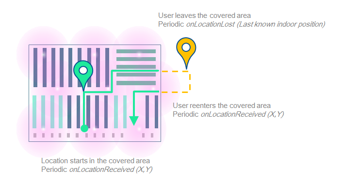
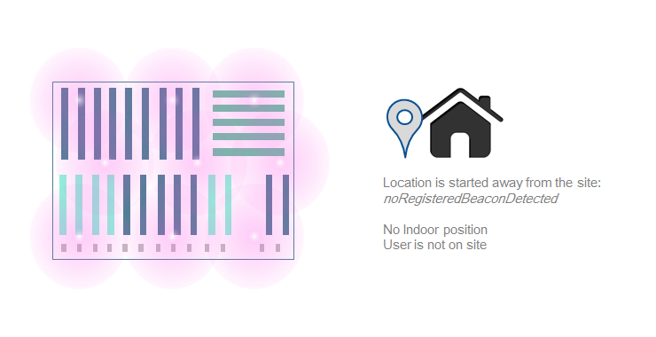
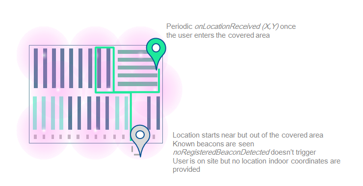
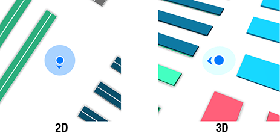

# Location

## Requirements

- Successful SDK initialization and Site started (see [Getting Started Guide](../README.md)).
- **Packages dependencies**: you need to have downloaded and installed the `ISEPackageTypeLocation` package, which contains all location files and required data.
- **iOS 8+ compatibility**: Since iOS 8, you have to add the `NSLocationWhenInUseUsageDescription` or `NSLocationAlwaysUsageDescription` key in your `.plist` to access user location (see [Location Authorization Guide](../README.md#location-authorization-ios-8) for more details).

> **Reminder:** To check if a package is available for the current site, just call `[[Insiteo currentSite] hasPackage:My-PACKAGE-TYPE]`.

## 1. Location process





### Get your first location

The location service needs to be configured properly to retrive user location information and communicate with our backend. Every location process will be managed by the [`ISLocationProvider`](http://dev.insiteo.com/api/doc/ios/3.5/Classes/ISLocationProvider.html) class as a singleton.

#### Configurate the location provider

There are two ways to configure the provider:

- **Recommanded**: by adding the following keys in your application `.plist`:
 
```xml
<plist>
  ...
  <key>ISELocationFlag</key>
  <array>
   <!-- We highly recommand to use all flags for best location. Contact us for more details -->
   <string>ISELocationFlagGps</string> <!-- GPS detection -->
   <string>ISELocationFlagBle</string> <!-- BLE detection -->
   <string>ISELocationFlagCompass</string> <!-- Device orientation -->
   <string>ISELocationFlagMems</string> <!-- Device accelerometers -->
  </array>
</plist>
```
- Alternatively, you can pass the flags through the location provider start method as a bitmask (see following section for usage explanation).


#### Start location service

To begin receiving user location, you have to start the provider with [`startWithDelegate:`](http://dev.insiteo.com/api/doc/ios/3.5/Classes/ISLocationProvider.html#//api/name/startWithDelegate:) if you have defined flags in your application `.plist`, otherwise use [`startWithFlags:andDelegate:`](http://dev.insiteo.com/api/doc/ios/3.5/Classes/ISLocationProvider.html#//api/name/startWithFlags:andDelegate:) and pass all desired flags separated by a `|` (bitmask). To be notified on location initialization, on new location received, etc. you can set a [`ISLocationDelegate`](http://dev.insiteo.com/api/doc/ios/3.5/Protocols/ISLocationDelegate.html) which provides a couple of usefull callbacks to work with.

```objective-c
// Start location provider (flags in .plist)
[[ISLocationProvider sharedInstance] startWithDelegate:aDelegate];

// Start location provider directly with flags
[[ISLocationProvider sharedInstance] startWithFlags:ISELocationFlagGps|ISELocationFlagBle|ISELocationFlagCompass|ISELocationFlagMems
                                        andDelegate:aDelegate];
```

You are able to specify location frequency by calling an alternative [start method](http://dev.insiteo.com/api/doc/ios/3.5/Classes/ISLocationProvider.html#//api/name/startWithFlags:andDelegate:andScanFrequency:):

```objective-c
// Start location provider directly with flags and scan frequency (default 2000 ms)
[[ISLocationProvider sharedInstance] startWithFlags:ISELocationFlagGps|ISELocationFlagBle|ISELocationFlagCompass|ISELocationFlagMems
                                        andDelegate:aDelegate
                                   andScanFrequency:3000]; // 3s for example
```

Finally, you can ask for a unique location by calling the [`requestUniqueLocationWithLocationRequestDelegate:andLocationFlags:`](http://dev.insiteo.com/api/doc/ios/3.5/Classes/ISLocationProvider.html#//api/name/requestUniqueLocationWithLocationRequestDelegate:andLocationFlags:) method. For more methods or information, see [`ISLocationProvider`](http://dev.insiteo.com/api/doc/ios/3.5/Classes/ISLocationProvider.html) class reference.


#### Stop location service

To stop the location provider, simply call [`stopLocation`](http://dev.insiteo.com/api/doc/ios/3.5/Classes/ISLocationProvider.html#//api/name/stopLocation) method:

```objective-c
// Stop location provider
[[ISLocationProvider sharedInstance] stopLocation];
```

## 2. User Location Rendering

> **Note:** See our [Map View rendering guide](map.md) for more details about map and objects rendering.

User location can be rendered on map like other graphical objects through a special `ISRenderer` class that should be added on your map view. By default, the [`ISLocationRenderer`](http://dev.insiteo.com/api/doc/ios/3.5/Classes/ISLocationRenderer.html) class will draw a blue dot with azimuth and accuracy and which is created but not added on the map view. You will need to add it manually if you want to render the position on your map view:

```objective-c
// Get the location renderer from provider
ISLocationRenderer *locationRenderer = [ISLocationProvider sharedInstance].renderer;
// Add it to the map view
[self.mapView addRenderer:locationRenderer];
```

#### Customize user location

By default, user location rendering looks like:



For now, you can only change user location and accuracy colors and choose to display or hide the compass orientation triangle. Here are the properties to use in order to customize rendering:

- [`locationColor`](http://dev.insiteo.com/api/doc/ios/3.5/Classes/ISLocationRenderer.html#//api/name/locationColor) to change the dot and compass color (blue, by default),
- [`accuracyColor`](http://dev.insiteo.com/api/doc/ios/3.5/Classes/ISLocationRenderer.html#//api/name/accuracyColor) to change the accuracy circle color (light blue, by default),
- [`locationLostColor`](http://dev.insiteo.com/api/doc/ios/3.5/Classes/ISLocationRenderer.html#//api/name/locationLostColor) to change the dot and compass color when location has been lost.

> **Important**: If you attempt to customize rendering, you **must do it before trying to start location** in order for the changes to take effects. As best practices, do all customization before calling `[self.mapView startRendering]`.

#### Advanced customization

If you want to use different pictures or do more complex customizations, you will need to create your own renderer (`ISRenderer`) and RTO (`ISRTO`) (see [Graphical objects guide](map.md#2-add-graphical-objects-on-map) for more details or contact us for specific code request).


## 3. Mix Location With Other Services

Insiteo location service can be mixed to work with two other services ([`ISELbsModuleType`](http://dev.insiteo.com/api/doc/ios/3.5/Constants/ISELbsModuleType.html)):

-  [Itinerary](itinerary.md): this service will compute optimal route between two or several points and compute itineraries from/to user location (`ISELbsModuleTypeItinerary`).
- [Geofencing](geofencing.md): this service can detect when user location has crossed a specific region boundaries (enter or exit) and when it stays in the area (`ISELbsModuleTypeGeofencing`).

To access a specific service, you will need to call the [`getLbsModule`](http://dev.insiteo.com/api/doc/ios/3.5/Classes/ISLocationProvider.html#//api/name/getLbsModule:) method from the location provider:

```objective-c
// Get Itinerary module
ISItineraryProvider *itineraryProvider = (ISItineraryProvider *)[[ISLocationProvider sharedInstance] getLbsModule:ISELbsModuleTypeItinerary];

// Get Geofencing module
ISGeofenceProvider *geofenceProvider = (ISGeofenceProvider *)[[ISLocationProvider sharedInstance] getLbsModule:ISELbsModuleTypeGeofencing];
```


## Where To Go From Here?

- Map rendering:
	- [Display your first map](map.md).
	- [Add graphical objects on map](map.md#2-add-graphical-objects-on-map)
- Location:
	- [Setup your first geofencing zone](geofence.md).
	- [Configure your iBeacons](beacon.md).
	- [Room counting with iBeacons](room_counting.md).
- Itinerary:
	- [Compute your first itinerary](itinerary.md).
- Room counting:
	- [Track occupancy](https://github.com/Insiteo/ios-v3/tree/master/readme/room_counting.md).
- Analytics tracking events:
	- [Track Custom Events](analytics.md).