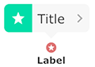
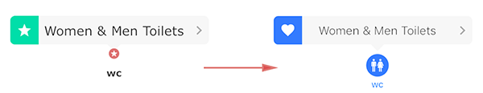
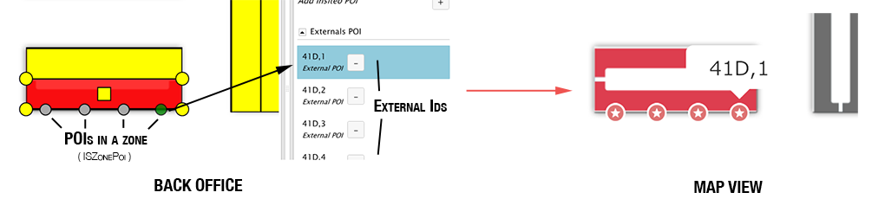

# Map Rendering

## Requirements

- Successful SDK initialization and Site started (see [Getting Started Guide](../README.md)).
- You **cannot use both 2D and 3D** in the same application session, you will have to kill and restart your application to switch from one to the other.
- **3D:** Do not forget to add and link the `glsl` folder in your Xcode project, otherwise the 3D engine will not work and will potentially crash.
- **Packages dependencies**: you need to have downloaded and installed at least the following packages:
	- `ISEPackageTypeMapData` package, which contains maps information such as zoom levels and scales.
	- `ISEPackageTypeTiles` package, which contains `.3cm` files to display your maps.
	- (3D only) `ISEPackageTypeMap3d` package, which contains specific rendering files.

> **Reminder:** To check if a package is available for the current site, just call `[[Insiteo currentSite] hasPackage:My-PACKAGE-TYPE]`.


## 1. Create and Display an Insiteo Map View

To display your 2D/3D map, you will have to use the [`ISMapView`](http://dev.insiteo.com/api/doc/ios/3.5/Classes/ISMapView.html) class which is the main class for map rendering. It will display a 2D/3D tiled map component and will provide basic map user interactions (pan, pinch to zoom, rotation, animated centering, touch detection, etc.) and advanced rendering (POI, zones, etc.).

To handle map view events (touch events, on zoom end, on map clicked, etc.), you must add a [`ISMapViewDelegate`](http://dev.insiteo.com/api/doc/ios/Protocols/ISMapViewDelegate.html) delegate on map view creation.

According to the selected render mode `ISERenderMode2D` or `ISERenderMode3D` respectively a [`ISMap2DView`](http://dev.insiteo.com/api/doc/ios/3.5/Classes/ISMap2DView.html) (`Cocos2D` engine) or a [`ISMap3DView`](http://dev.insiteo.com/api/doc/ios/3.5/Classes/ISMap3DView.html) (`Cocos3D` engine) can be created. Here is a snippet of code that explain how to create a map view according to the render mode:

```objective-c
// Check common packages
if ([[Insiteo currentSite] hasPackage:ISEPackageTypeMapData] &&
    [[Insiteo currentSite] hasPackage:ISEPackageTypeTiles]) {
    
    // Check render mode
    if ([Insiteo currentUser].renderMode == ISERenderMode2D) {
        // 2D
        [ISMap2DView getMap2DViewWithFrame:self.view.frame andMapDelegate:self andHandler:^(ISMap2DView *map2DView) {
            // At this point, the map view is correctly initialized
            self.mapView = map2DView;
            [self.view addSubView:map2DView];
        }];
    } else if ([Insiteo currentUser].renderMode == ISERenderMode3D) {
        // Check 3D package
        if ([[Insiteo currentSite] hasPackage:ISEPackageTypeMap3d]) {
            // 3D
            [ISMap3DView getMap3DViewWithFrame:self.view.frame andMapDelegate:self andHandler:^(ISMap3DView *map3DView) {
                // At this point, the map view is correctly initialized
                self.mapView = map3DView;
                [self.view addSubView:map3DView];
            }];
        }
    } else {
        // Unknown, something wrong happened or is not well initialized...
    }
}
```

### Start map view rendering

When your map is created and every other rendering objects are prepared, you can start rendering by calling [`startRendering`](http://dev.insiteo.com/api/doc/ios/3.5/Classes/ISMapView.html#//api/name/startRendering):

```objective-c
// Prepare all rendering customization (location/itinerary/custom) before !
...
// Then start rendering
[self.mapView startRendering];
```

As best practices, we recommend you to start and stop the map rendering according to the parent `UIViewController` state changes.

```objective-c
- (void)viewDidAppear:(BOOL)animated {
    [super viewDidAppear:animated];
    ...
    // Start rendering
    [self.mapView startRendering];
}

- (void)viewDidDisappear:(BOOL)animated {
    [super viewDidDisappear:animated];
    ...
    // Stop rendering
    [self.mapView stopRendering];
}
```


## 2. Add Graphical Objects on Map

The `ISMapView` allows you to display custom interactive objects (`RTO` for Rendering Touch Object) and provides a specific interface [`ISRTO`](http://dev.insiteo.com/api/doc/ios/Protocols/ISRTO.html) which defines all properties and methods to create graphical objects and an interface [`ISRenderer`](http://dev.insiteo.com/api/doc/ios/Protocols/ISRenderer.html) to render them on the map view. The `ISMapView` will also detect touches dispatched to all `ISRTO` objects. To handle selection and clicks on specific `ISRTO` objects, you can implement the [`ISRTODelegate `](http://dev.insiteo.com/api/doc/ios/3.5/Protocols/ISRTODelegate.html) which provides a couple of useful callbacks (`onRTOClicked`, `onRTOMoved`, etc.).

### ISRTO objects

To draw custom rendering objects on map, you will need to create a class that is conformed to the `ISRTO` protocol. Then you will be able to specify your object's behavior through methods like:

```objectivec++
// Define resources such as marker images, labels, etc.
- (void)setResources;

// 2D rendering methods
- (void)render2DWithLayer:(CCLayer *)layer andRatio:(double)ratio andOffset:(CGPoint)offset andAngle:(float)angle andPriority:(int)priority;
- (void)remove2DFromLayer:(CCLayer *)layer;

// 3D rendering methods
- (void)render3DWithScene:(CC3Scene *)scene andLayer:(CC3Node *)layer andCurrentMap:(ISMap *)map andRatio:(float)ratio andAngle:(float)angle andPriority:(int)priority;
- (void)remove3DFromLayer:(CC3Node *)layer;

// Touch methods
- (ISETouchObjectResult)onTouchDown:(ISTouch *)touch;
- (ISETouchObjectResult)onTouchMove:(ISTouch *)touch;
- (ISETouchObjectResult)onTouchUp:(ISTouch *)touch;
```

When your class is ready, you can simply add your custom RTO like:

```objective-c
// Create a RTO (for example with a label and a specific zoom level to be rendered)
id<ISRTO> myCustomRTO = [[MyCustomRTO alloc] initWithLabel:@"My-Label" zoomLevel:2];
// Add it to the map view
[self.mapView addRTO:myCustomRTO];
```

And to subscribe RTOs events such as click, move and drag events, add 

```objective-c
// Add a delegate for this type of IRTO
[self.mapView setRTODelegate:self withRTOClass:[MyCustomRTO class]];
```

> **Note:** When RTOs are added and rendered on map, when you don't need them (not visible on screen, not on the same map floor, etc.), you should call 2D or 3D remove method to limit memory and CPU usage.

### ISRTO renderer

A renderer is a class that defines drawing and touch behavior for a specific type of `ISRTO`. If you want to use your own customized renderer, you will need to create a class that is conformed to the [`ISRenderer`](http://dev.insiteo.com/api/doc/ios/Protocols/ISRenderer.html) protocol. Once added to the `ISMapView` the renderer rendering method ([`render2D`](http://dev.insiteo.com/api/doc/ios/Protocols/ISRenderer.html#//api/name/render2DWithLayer:andRatio:andOffset:andAngle:) or [`render3D`](http://dev.insiteo.com/api/doc/ios/Protocols/ISRenderer.html#//api/name/render3DWithScene:andRatio:andAngle:)) will be called during the map rendering loop and will be notified to handle its own touch operations ([`onTouchDown`](http://dev.insiteo.com/api/doc/ios/Protocols/ISRenderer.html#//api/name/onTouchDown:), [`onTouchMove`](http://dev.insiteo.com/api/doc/ios/Protocols/ISRenderer.html#//api/name/onTouchMove:), [`onTouchUp`](http://dev.insiteo.com/api/doc/ios/Protocols/ISRenderer.html#//api/name/onTouchUp:)).

`ISRenderer` uses a priority value that will define it's 2D rendering and touch order. Highest priority renderered last (so on the top) and notify by touch first.

To register a new renderer as a map's renderer, simply do like this:

```objective-c
// Create your custom RTO renderer
id<ISRTORenderer> myCustomRenderer = [[MyCustomRenderer alloc] initWithRTOClass:[MyCustomRTO class] priority:7];
// Add it to the map view to inform that MyCustomRTO objects will be rendered through this renderer
[mapView addRenderer: myCustomRenderer]];
```

> **Note:** You are **not required** to create a `ISRenderer` class by yourself, by default, when no renderer is specified for a `ISRTO` class, the map view will automatically create a `ISGenericRenderer` to render your RTO class (see the following section). 

### Time Saving: Use Generic RTOs

To help you adding POIs on your map, we provide you the [`ISGenericRTO`](http://dev.insiteo.com/api/doc/ios/3.5/Classes/ISGenericRTO.html) and the [`ISGenericRenderer`](http://dev.insiteo.com/api/doc/ios/3.5/Classes/ISGenericRenderer.html) classes which respectively are conforms to `ISRTO` and `ISRenderer` protocols and implements common behaviors (marker with label and button, touch handling, etc.). We tried to make this class as modular and overridable as possible (multiple constructors, access to many properties) in order to let you customize the RTO. Most of the time, if you attempt to change a particular behavior or want to change RTO design, you can create a class that inherits from the `ISGenericRTO` class. By default, when the RTO is clicked, the window visibility is toggled (if hidden -> visible, visible -> hidden).

The `ISGenericRTO` has a marker icon, a label and a floating window with a buttons and title and looks like:




#### Add and Remove Generic RTOs

You can add or remove RTOs on map view using an Insiteo meter position directly (see [`ISPosition`](http://dev.insiteo.com/api/doc/ios/3.5/Classes/ISPosition.html) class):

```objective-c
// Create RTO with a position with default resources
ISGenericRTO *rto = [[ISGenericRTO alloc] initWithName:@"My name"
                                              andLabel:@"My label"
                                     andMetersPosition:rtoPosition // a position in meters
                           andWindowInitiallyDisplayed:YES // Yes, I want to display the window
                            andLabelInitiallyDisplayed:YES]; // and the label under the marker when added
// Simply add
[self.mapView addRTO:rto];
// or remove it
[self.mapView removeRTO:rto];
```

#### Customize Generic RTO

We tried to provide as much constructors as possible to let you customize the generic RTO as you want. If you want to change default images and default colors, you will have to use the [full class constructor](http://dev.insiteo.com/api/doc/ios/3.5/Classes/ISGenericRTO.html#//api/name/initWithName:andLabel:andMetersPosition:andWindowInitiallyDisplayed:andWindowShouldToggle:andLabelInitiallyDisplayed:andLabelShouldToggle:andWindowBackgroundColorNormal:andWindowBackgroundColorHighlighted:andActionEnabled:andActionImagePath:andActionBackgroundColorNormal:andActionBackgroundColorHighlighted:andIndicatorVisible:andIndicatorImagePath:andWindowAnchorImagePath:andMarkerImagePath:) to pass your images path and your application design colors. Then, if you want to change other properties, like texts font, colors, position etc. you can but you will have to override the [`setResources`](http://dev.insiteo.com/api/doc/ios/Protocols/ISRTO.html#//api/name/setResources) method and change what you want.

##### Example

We will create a RTO class that inherits from `ISGenericRTO` and we will customize as much as we can to show you how to do that properly. Here is what we expect:


 
Here is all the code to customize the generic RTO:

```objective-c
// 1. Create a class that inherits from ISGenericRTO

#import <InsiteoSDK/InsiteoSDK.h>

@interface CustomRTO : ISGenericRTO

// Add your custom properties, custom constructor and methods
- (instancetype)initWithPosition:(ISPosition *)position;

@end

// 2. Implement your customization

@implementation CustomRTO

#pragma mark - Initialization

- (instancetype)initWithPosition:(ISPosition *)position {
    // Get your images path
    NSString *markerPath = [[NSBundle mainBundle] pathForResource:@"marker-toilet" ofType:@"png"];
    NSString *favPath = [[NSBundle mainBundle] pathForResource:@"favorite" ofType:@"png"];
    
    // Use the full constructor to pass as many parameters as you want
    self = [super initWithName:@"Women & Men Toilets"
                      andLabel:@"wc"
             andMetersPosition:position
   andWindowInitiallyDisplayed:NO
         andWindowShouldToggle:YES
    andLabelInitiallyDisplayed:YES
          andLabelShouldToggle:NO
andWindowBackgroundColorNormal:[UIColor colorWithRed:0.9 green:0.9 blue:0.9 alpha:1]
andWindowBackgroundColorHighlighted:nil
              andActionEnabled:YES
            andActionImagePath:favPath
andActionBackgroundColorNormal:[UIColor colorWithRed:0.2 green:0.48 blue:1 alpha:1]
andActionBackgroundColorHighlighted:[UIColor colorWithRed:0.25 green:0.52 blue:1 alpha:1]
           andIndicatorVisible:YES
         andIndicatorImagePath:nil
      andWindowAnchorImagePath:nil
            andMarkerImagePath:markerPath];
    if (self) {
        // For this example we don't need to do anything else here
    }
    return self;
}

#pragma mark - Override ISGenericRTO methods

// This method is called when a RTO is clicked, by default it returns `YES` so you can override or 
// add specific feature
- (Boolean)shouldToggleWindowOnMarkerClicked {
	// For example, we will specified that this clicked RTO should be drawn on top of the other
	// so I change its z-order to 0.
    self.zOrder = 0; // Will be drawn on top
    return YES;
}

// This is in this method that all customization should be done, in order to be called only once
- (void)setResources {
	 // Call super in order to initialize properly each default resources 
    [super setResources];
    
    // Then do your customization here...
    
    // Adjust window positions to be as you want (according to your marker image size)
    CGPoint windowPosition = self.rtoNode.annotationLayerColor.position;
    [self.rtoNode.annotationLayerColor setPosition:CGPointMake(windowPosition.x, windowPosition.y + 8)];
    
    CGPoint anchorPosition = self.rtoNode.windowAnchorSprite.position;
    [self.rtoNode.windowAnchorSprite setPosition:CGPointMake(anchorPosition.x, anchorPosition.y + 8)];
    
    CGPoint actionBGPosition = self.rtoNode.actionBackgroundSprite.position;
    [self.rtoNode.actionBackgroundSprite setPosition:CGPointMake(actionBGPosition.x, actionBGPosition.y + 8)];
    
    CGPoint indicatorBGPosition = self.rtoNode.indicatorBackgroundSprite.position;
    [self.rtoNode.indicatorBackgroundSprite setPosition:CGPointMake(indicatorBGPosition.x, indicatorBGPosition.y + 8)];
    
    // Name
    CGPoint namePosition = self.rtoNode.descriptionName.position;
    [self.rtoNode.descriptionName setPosition:CGPointMake(namePosition.x, namePosition.y + 8)];
    [self.rtoNode.descriptionName setFontName:[UIFont systemFontOfSize:18 weight:UIFontWeightThin].fontName]; // Change the font
    [self.rtoNode.descriptionName setFontSize:18]; // New font size
    
    // Label
    CGPoint labelPosition = self.rtoNode.descriptionLabel.position;
    [self.rtoNode.descriptionLabel setPosition:CGPointMake(labelPosition.x, labelPosition.y - 10)];
    [self.rtoNode.descriptionLabel setFontName:[UIFont systemFontOfSize:14 weight:UIFontWeightMedium].fontName];
    [self.rtoNode.descriptionLabel setFontSize:14]; 
    [self.rtoNode.descriptionLabel setColor:ccc3(51, 123, 255)]; // New text color
    
    // We do not want the default stroke label
    [self.rtoNode.descriptionStrokeLabel removeFromParent];
}

// 3. And that's all, I think that you can be able to customize as much as possible this class to match your application design ! 
// For advanced customizations, please use Cocos2D/3D documentation and create your own ISRTO class and ISRTORenderer.

@end

```


### Link POIs With External Content

The Insiteo SDK allows you to link external content to POIs by using our back office. You have to create zones on your map, define POIs with `identifier` to be retrieved through the SDK.
Here is a quick tutorial video that shows you how to process to create zones with identifier on your map:

[](https://www.youtube.com/watch?v=lFgNcIqiuOM)

Once your POIs are defined on the back office, retrieved from SDK initialization and update, you are ready to link each POIs identifiers to your custom data. Your back office zones are represented by the [`ISZone`](http://dev.insiteo.com/api/doc/ios/3.5/Classes/ISZone.html) class object and can be retrieved for a specific `ISSite` and `mapId` through its [`getZonesWithMapId:`](http://dev.insiteo.com/api/doc/ios/3.5/Classes/ISSite.html#//api/name/getZonesWithMapId:) method. Finally, the association between a zone and POIs is represented by the [`ISZonePoi`](http://dev.insiteo.com/api/doc/ios/3.5/Classes/ISZonePoi.html) class.

`ISZonePoi` objects can be retrieved with a zone identifier and the [`ISDBHelperMap`](http://dev.insiteo.com/api/doc/ios/3.5/Classes/ISDBHelperMap.html) class which is a helper class around the map view.

> **Note:** an `ISZone` can contain several `ISZonePoi` and a POI can be linked to several zones.

Basically, you can add RTOs on map view based on zones identifier and position instead of a meter position (you will add an offset from zone center). For example, when a click is detected on a zone on the map view, you may want to display all RTOs which have been created on back office into that specific zone by using the `ISMapView` [`addRTO:inZone:withOffset:`](http://dev.insiteo.com/api/doc/ios/3.5/Classes/ISMapView.html#//api/name/addRTO:inZone:withOffset:):

```objective-c
// ISMapViewDelegate callback
- (void)onZoneClickedWithZone:(ISZone *)zone {
    // Get external zone pois associations for the clicked zone
    NSArray *zonesPois = [ISDBHelperMap getZonePoisForIdZone:zone.idZone andExternal:YES];
    if ([zonesPois count] > 0) {
        // Clear all other ISGenericRTO/CustomRTO to only display new one(s)
        [self.mapView clearRendererWithRTOClass:[ISGenericRTO class]];
        [self.mapView clearRendererWithRTOClass:[CustomRTO class]];
        
        for (ISZonePoi *zonePoi in zonesPois) {
            // Add new one
            ISGenericRTO *rto = [[ISGenericRTO alloc] initWithName:zonePoi.externalPoiId
                                                          andLabel:@"My label"
                                                 andMetersPosition:nil // No position needed here
                                       andWindowInitiallyDisplayed:NO
                                        andLabelInitiallyDisplayed:NO];
            // This will add the RTO at the center of the zone + offset
            [self.mapView addRTO:rto 
                          inZone:zone.idZone 
                      withOffset:cc3v(zonePoi.offset.x, zonePoi.offset.y, 0)]; // Add z offset for 3D
        }
    }
}
...
// To remove a rto from a zone
[self.mapView removeRTO:rto fromZone:zoneId];
```

To get all related Insiteo zones for a given external POI, you can use:

```objective-c
// Get all Zone/POI assocations for a given external identifier
NSArray *zonesPois = [ISDBHelperMap getExternalZonePoisForExtIdPoi:externalPoiId];
```

Here is an illustration of defined POIs in a zone on back office, retrieved and convert to `ISZonePoi` and finally displayed as a `ISGenericRTO`:




## Where To Go From Here?

- Location:
	- [Get your first location](location.md).
	- [Setup your first geofencing zone](geofence.md).
	- [Configure your iBeacons](beacon.md).
	- [Room counting with iBeacons](room_counting.md).
- Itinerary:
	- [Compute your first itinerary](itinerary.md).
- Analytics tracking events:
	- [Track Custom Events](analytics.md).